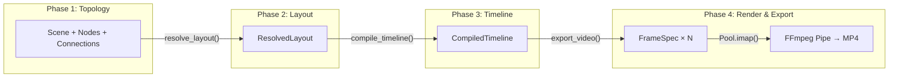

# Architecture Deep-Dive

ArchMotion renders system architecture diagrams into animated video walkthroughs using a **4-Phase Pipeline**. Each phase is strictly separated, communicating only through well-defined data contracts.

---

## Pipeline Overview



---

## Phase 1: Topology Collection

The user constructs a **Scene Graph** by creating `Node`, `Database`, `Cloud`, `Queue`, `Cache`, and `User` primitives, then connecting them with `Connection` objects.

**Key classes:**

- `Scene` — Orchestrator. Collects topology, records animations, dispatches render.
- `Node` — Rectangular server/service box.
- `Database` — Cylinder-shaped data store.
- `Connection` — Directed edge with Manhattan routing.

**Relative Positioning:**

```python
db.right_of(gateway, distance=4)  # 4 grid units to the right
cache.below(gateway, distance=3)  # 3 grid units below
```

Positions are stored as relative references and resolved to absolute pixel coordinates in Phase 2.

---

## Phase 2: Layout Resolution

The **Layout Resolver** (`layout/resolver.py`) converts relative positioning into absolute pixel coordinates.

**Algorithm:**

1. Build a DAG (Directed Acyclic Graph) from position dependencies.
2. Topological sort to determine evaluation order.
3. Convert grid units → pixel offsets (1 unit = `GRID_UNIT` pixels).
4. Assign `BoundingBox` to each node using Skia font metrics.
5. Center the entire diagram on the canvas.
6. Route connections using Manhattan Router (L/I-shape orthogonal paths).

**Output:** `ResolvedLayout` containing:

- `node_boxes: dict[str, BoundingBox]` — Pixel-perfect bounding boxes.
- `connection_routes: dict[str, list[Point]]` — Routed polyline paths.

**Error detection:**

- `OrphanNodeError` — Node without a position anchor.
- `OverflowCanvasError` — Diagram exceeds canvas boundaries.
- `CyclicDependencyError` — Circular position references.

---

## Phase 3: Timeline Compilation

The **Timeline Compiler** (`timeline/compiler.py`) converts `play()` and `wait()` calls into discrete `ScheduledAction` objects with absolute timestamps.

**Decomposition rules:**

| Animation | → ScheduledAction |
|---|---|
| `FadeIn(node)` | `OPACITY: 0 → 1` over duration |
| `FadeOut(node)` | `OPACITY: 1 → 0` over duration |
| `Transfer(conn)` | `PATH_PROGRESS: 0 → 1` (packet slides along route) |
| `Pulse(node)` | `GLOW_INTENSITY: 0 → peak → 0` (ramp up then down) |
| `Highlight(node)` | `GLOW_INTENSITY: 0 → intensity` (persistent) |
| `ColorShift(node)` | `COLOR_R/G/B: from → to` over duration |
| `ScaleUp(node)` | `SCALE: 1 → factor` over duration |
| `ScaleDown(node)` | `SCALE: factor → 1` over duration |

**Output:** `CompiledTimeline` with:

- `total_frames: int` — Total frame count.
- `actions: tuple[ScheduledAction, ...]` — All scheduled property changes.
- `transfer_metas: tuple[TransferMeta, ...]` — Packet rendering metadata.

Each `ScheduledAction` supports **O(1) `value_at(t)`** — no iteration needed.

---

## Phase 4: Render & Export

The **Renderer** and **Exporter** work together:

1. **Frame Spec Generation** — Build a `FrameSpec` for each frame containing all data needed to paint it.
2. **Multiprocessing Pool** — `Pool.imap()` distributes frame rendering across CPU cores.
3. **Skia Canvas** — Each worker creates a `SkiaCanvas`, paints layers in Z-order (connections → nodes → packets → effects), and returns raw RGBA bytes.
4. **FFmpeg Pipe** — Main process streams bytes directly to FFmpeg via stdin pipe. Zero disk I/O.

**Z-index layers:**

| Z-Index | Layer | Contents |
|---|---|---|
| 10 | Connections | Manhattan polylines + arrowheads |
| 20 | Nodes | Rectangles, cylinders, clouds, etc. |
| 40 | Packets | Colored circles sliding along paths |
| 50 | Effects | Glow, highlights, annotations |

**Memory Invariants:**

- Each worker process holds exactly 1 canvas in memory at a time.
- Main process streams bytes immediately — no frame accumulation.
- Peak RAM target: < 512MB for a 10-second video.

---

## Theme System

ArchMotion v0.2.0 ships with 4 themes:

| Theme | Style | Best For |
|---|---|---|
| `dark_terminal` | Dark background, muted colors | Technical presentations |
| `neon_cyber` | Deep black + neon glows (cyan, magenta) | Eye-catching demos |
| `blueprint` | Blue background, white wireframe | Engineering documentation |
| `light_paper` | White background, dark borders | Reports, slides, print |

```python
scene = Scene(theme="neon_cyber")
```

---

## YAML AI Interface

The `archmotion.ai` package allows LLMs to generate YAML that compiles into animated videos:

```
User → "Draw an OAuth2 flow"
  → LLM reads prompt_template.md
  → LLM generates YAML
  → parse_yaml_string(yaml) → Scene
  → scene.render() → video.mp4
```

Security: `yaml.safe_load()` only, 1MB file limit, Pydantic validation, no `eval()`.
